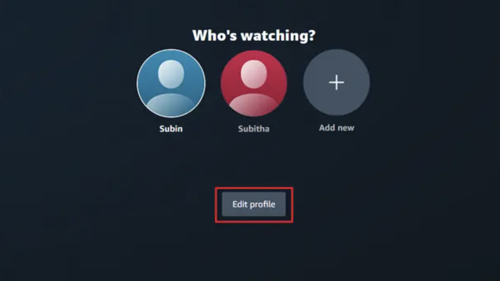
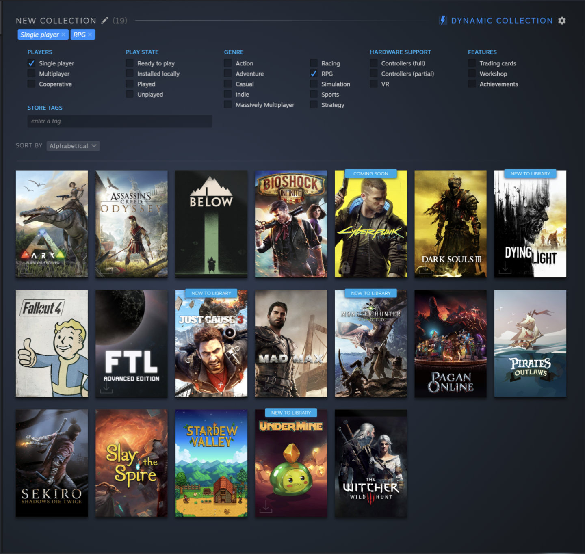
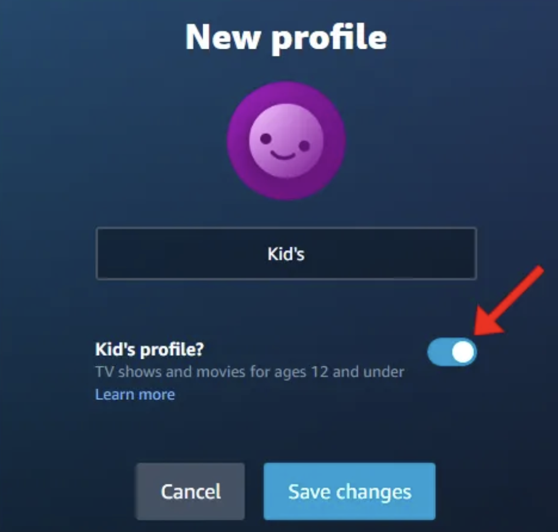

# The completionist test

Esta prueba consiste en maquetar y programar una aplicación que me permitirá llevar la cuenta de mis películas y videojuegos favoritos.

En esta prueba se valorarán los conocimientos de los patrones SOLID, arquitectura limpia, la optimización y la mantenibilidad así como una buena programación reactiva.

- El proyecto debe construirse con la versión 17 de Angular.
- La maquetación debe hacerse con TailwindCSS y debe ser responsive
- Los datos deberán persistir, no habrá que utilizar un back-end para ello.
- Se valorará el uso de modelo de datos, servicios, observables y buen uso de componetización

El ejercicio consiste en varias partes:

## Selección de usuarios

En esta parte de la aplicación tendremos que seleccionar el perfil de usuario que queramos usar. La maquetación deberá ser parecida a la imagen mostrada arriba

- Los perfiles deben crearse desde cero, para ello, al pulsar sobre el botón “Añadir nuevo” utilizaremos la API de https://rickandmortyapi.com/documentation/ para recibir los datos de un usuario y mostrarlo.
- Los perfiles deben quedarse guardados, al hacer click sobre ellos pasaremos a la siguiente pantalla.

## Listado de completados

En esta pantalla mostraremos todo el listado tanto de películas cómo de videojuegos, gestionados por un filtro. Se valorará la optimización y rendimiento.

- La maquetación de las películas y videojuegos tiene que ser parecida a la imagen mostrada arriba. Para ello, carga y utiliza los mocks <b>movies.json</b> y <b>videogames.json</b> que encontrarás en el proyecto
- Al pulsar sobre un elemento del listado, lo guardaremos como “Completado” y cambiará su diseño (Libre elección)
- La maquetación del filtro es de libre elección y creatividad
- El filtro debe mínimo filtrar por películas, videojuegos, completados y categorías. Los cambios en el filtro deben verse reflejados en el listado al instante
- La pantalla deberá tener un botón de volver atrás, cuando el usuario haga click sobre él nos devolverá a la selección de perfil.
- En la selección de perfil, se nos mostrará la cantidad de elementos completados de ese perfil.
- Si entro a un perfil se me volverán a cargar únicamente los elementos completados de ese perfil

### Opcionales

- En la pantalla de selección de camarero, le daremos al usuario la capacidad de editar el perfil que queramos. Cuando eso ocurra, podremos cambiarle el nombre, borrar el perfil o simplemente borrar todo su listado de completados.

- En la pantalla de listado de completados podremos marcar cómo favoritos tanto películas como videojuegos, existiendo botón que nos filtre por favoritos
# technical-test-frontend-master
